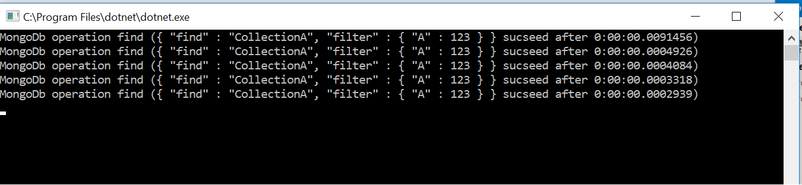
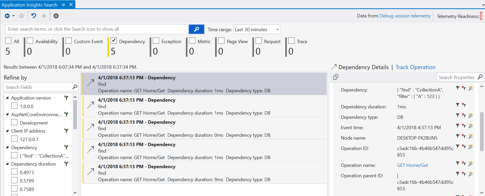

# DependencyTracking.MongoDb
Extend MongoClient with possibility to log queries into abstract logger.

To use this library, you need to provide implementation of logger, for instance: [Console logger] [#console-logger] or [Application insight logger] [#application-insight-logger]

## Samples

This repository includes two samples:

* [Console logger](https://github.com/apostolsergii/DependencyTracking.MongoDb/tree/master/DependencyTracking.MongoDb.SampleApp)
* [Application insight logger](https://github.com/apostolsergii/DependencyTracking.MongoDb/tree/master/DependencyTracking.MongoDb.SampleWebApp)

## Usage

* Implement IDependencyTracker with desired logs target;
* Implemenet ILooger (optional) if you would like to log exception that can possibly occure in DependencyTrecker;
* Create instance of MongoClientSettingsFactorySettings (optional) if you would like to control queries that should be tracked. By default tracker will catch all queries except: "isMaster", "buildInfo", "getLastError", "saslStart", "saslContinue";
* Create instance of MongoClientFactory and get MongoClient from factory;
* Use instance of MongoClient in your repositories

## Console logger

```csharp

//loger implementation
public class Logger : ILogger, IDependencyTracker
{
	public void Exception(Exception exception)
	{
		Console.WriteLine(exception);
	}

	public void Dependency(string name, string description, bool success, TimeSpan duration)
	{
		var status = success ? "sucseed" : "failed";
		Console.WriteLine($"MongoDb operation {name} ({description} {status} after {duration:g})");
	}
}

class Program
{
	static void Main()
	{
		var connectionString = "mongodb://localhost:27017";

		var logger = new Logger();
		var mongoClientFactory = new MongoClientFactory(logger, new MongoClientSettingsFactorySettings(), logger);
		var client = mongoClientFactory.GetClient(connectionString);
		var db = client.GetDatabase("TestDb");
		var collection = db.GetCollection<BsonDocument>("CollectionA");
		for (int i = 0; i < 5; i++)
		{
			collection.FindAsync(new JsonFilterDefinition<BsonDocument>("{'A':123}")).GetAwaiter().GetResult();
		}
		
		Console.ReadKey();
	}
}
```

Console output:


## Application insight logger

```csharp
//Logger implementation as a wrapper around TelemetryClient
public class Logger : ILogger, IDependencyTracker
{
	private readonly TelemetryClient _telemetryClient;

	public Logger(TelemetryClient telemetryClient)
	{
		_telemetryClient = telemetryClient;
	}

	public void Exception(Exception exception)
	{
		_telemetryClient.TrackException(exception);
	}

	public void Dependency(string name, string description, bool success, TimeSpan duration)
	{
		_telemetryClient.TrackDependency("DB", "MongoDb", name, description, DateTimeOffset.UtcNow, duration, null,
			success);
	}
}

//Register necesery dependencies: ILogger, IDependencyTracker and MongoClientFactory
public void ConfigureServices(IServiceCollection services)
{
	services.AddMvc();
	services.AddSingleton<ILogger, Logger>();
	services.AddSingleton<IDependencyTracker, Logger>();
	services.AddSingleton<MongoClientFactory>();
	services.AddSingleton<MongoClientSettingsFactorySettings>();
}

public class HomeController : Controller
{
	private readonly MongoClientFactory _clientFactory;

	public HomeController(MongoClientFactory clientFactory)
	{
		_clientFactory = clientFactory;
	}


	// GET api/test
	[HttpGet]
	public async Task<IActionResult> Get()
	{
		const string connectionString = "mongodb://localhost:27017";

		var client = _clientFactory.GetClient(connectionString);
		var db = client.GetDatabase("TestDb");
		var collection = db.GetCollection<BsonDocument>("CollectionA");

		for (var i = 0; i < 5; i++)
		{
			await collection.FindAsync(new JsonFilterDefinition<BsonDocument>("{'A':123}"));
		}

		return Ok();
	}
}
```

Application insight output:



## Highlights

* track query duration
* track query in Json format
* track query status
